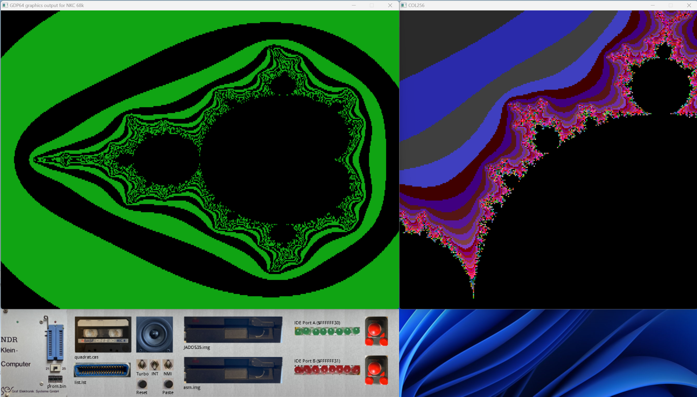
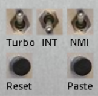
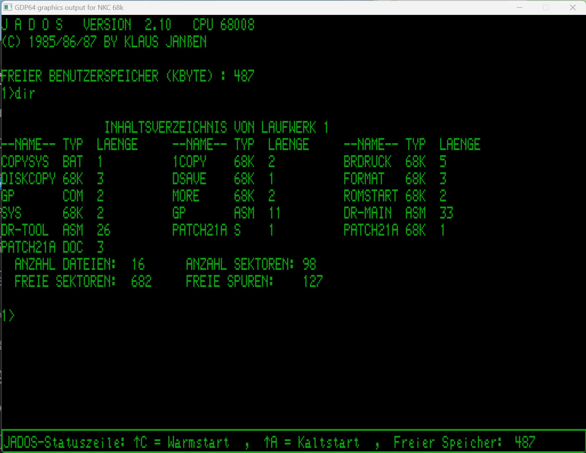
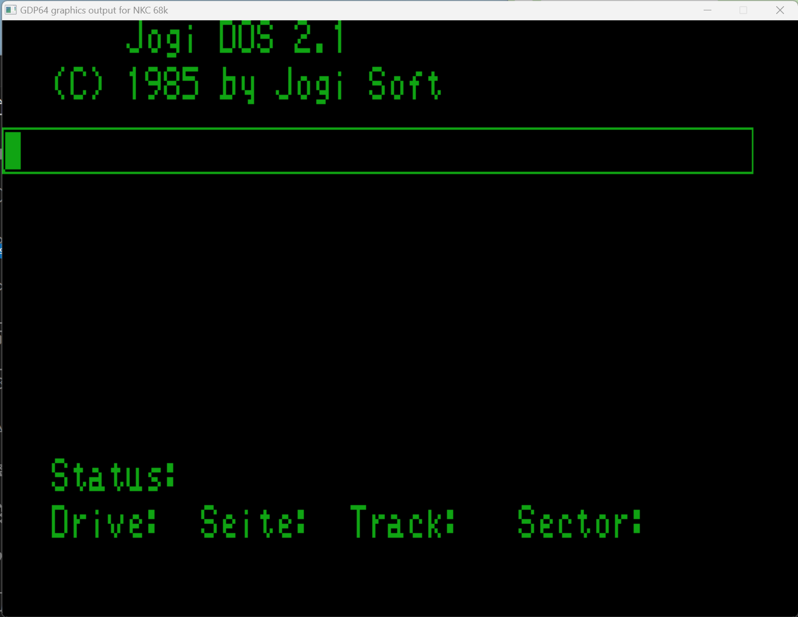

# 68k-NKCEmu

A Simulator of the NDR-Klein Computer. (https://de.wikipedia.org/wiki/NDR-Klein-Computer)

Detiales information on the NDR-Klein Computer can be found on Anreas Rohmans impressive page: (https://www.ndr-nkc.de/compo/index.htm) 

## Introduction

This 68k-NKCEmu emulator simulates the Motorola 68008 version of the NDR-Klein Computer. A emulator for the Z80 version of the NKC was developed by Torsten Evers and is available at (https://github.com/Nightwulf/NKCEmu).

## Acknowledgments 

### Musashi

The Emulator uses the Musashi 68000 emulator code. This great emulator is included without modifications in a own subdirectory. You can find the original under https://github.com/kstenerud/Musashi.
Please also refer to the [readme](./Musashi/readme.txt) file for a full attribution.

### AYUMI 

For the sound emulation of the AY-3-8910 we include the Ayumi C code by Peter Sovietov. https://github.com/true-grue/ayumi.

### GDP64 implementation from Torsten Evers

The GDP64 emulation is a direct copy from Torsten Evers code of the NKCEmu project emulating the Z80 version of the NDR-Klein computer. (https://github.com/Nightwulf/NKCEmu).
There are some small changes to adapt the code for SDL2, fix some small bugs and add a scalling factor to increase the window size and get a better aspect ratio on modern displays.
Thanks Torsten for the permission to use your implementation.

### SDL2 Cmake Modules

It was quite difficult to make the CMake files platform independent and different versions of CMake have different ways of finding the SDL2 packages needed on the individual poatforms. I therfore use the SDL2 CMake modules from Amine B. Hassouna. (https://github.com/aminosbh/sdl2-cmake-modules)

### CP/M 68K images

CP/M is distributed as disk imagea for the NKC computer. We refer to the E-Mail from Bryan Sparks to Scott Chapman (http://www.cpm.z80.de/license.html) which states:
> "Let this paragraph represent a right to use, distribute, modify, enhance, and otherwise 
> make available in a nonexclusive manner CP/M and its derivatives. This right comes from 
> the company, DRDOS, Inc.'s purchase of Digital Research, the company and all assets, 
> dating back to the mid-1990's. DRDOS, Inc. and I, Bryan Sparks, President of DRDOS, 
> Inc. as its representative, is the owner of CP/M and the successor in interest of 
> Digital Research assets."

### ROM images

The ROM images included in this project come from the great webside on the NDR-Klein Computer of Andreas Rohrmann at (https://www.ndr-nkc.de/compo/index.htm).

## Installation

The code in this repository should compile on different OSes (Windows10/11, MacOSX, Linux and WSL2) which have a POSIX compliant toolchain. It has been developed under Windows with MSYS2 and the UCRT toolchain and WSL2 with an Ubuntu image and under an M1 Apple Laptop with MacOSX.

Detailed setup instructions for the different platforms are provided:

* [Windows](./docs/windows.md)
* [Mac OSX](./docs/macosx.md)
* [Linux](./docs/linux.md)

The repository also contains ready ZIP files for released versions wih all needed resources and compiled executable. THese are currently only available for Windows, Linux x64 and Linux Arm64.

## Basic Operations

After startinfg the simulation by invoking the executable (68k-nkcemu) 3 windows should open (GDP64 graphics screen, Col256 graphics screen and the Frontpanel GUI). The BIOS will boot to the GDP screen. The fronnt panel screnn will have no border on Windows or MacOSX. On Linux it will have a boarder to allow positioning of the window (see Wayland-roblem below). All windows should be arranged nicely, however if you use Linux and the Wayland  display server (Raspberry PI with Rasperian) the windows will all display center and on top of each other. 
**ATENTION: Wayland Problem:** positioning of windows from code is not possible in Wayland and you have to arrange the windows manually. If you are using X11 this problem should not be present.

The fron panel has different symboly for different parts you can configure. Clicking on the images will open a dialog inside the GDP64 window, with clasical NKC keyboard navigation. You can configure the following oprions using the front panel images:

* Promer ZIF-Socket: Select the PROM file used by the PROMER EPROM programmer. See also the [PROMER description](./docs/promer.md).
* Cassette tape: Select the CAS file to be used with the CAS cassette interface. See also the [CAS description](./docs/cas.md).
* Centronics connector: Select the listing file file fpr printer output. See also the [CENTRONIC description](./docs/centronics.md).
* Speaker: Select the audio device to use for sounds. See also the [SOUND description](./docs/sound.md).
* Floppy Drives: Select the image files for the floppy disk drive simulation. See also the [FLO2 description](./docs/flo2.md). These files can be hot-swapped during ooperations but you may need to execute a operating system warm start (Ctrl-C) for the OS to recognize the change.
* Joysticks: You may attach joysticks to the IOE IO ports. See also the [IOE description](./docs/ioe.md).

In addition to the symbiols for the peripheral devices 3 toggle switches and to push buttons are available on the front panel as shown in the image below:

The following table describes the functionality of these switches and buttons:

|         | On | Off | Default
| ------- | ------------------------ | ------------------------ | ----
| Turbo   | Run simulation at maximal speed | Simulate real CPU speed as configured  | On
| INT     | Connect V-Sync to /INT line (Please make sure you have an exception handler configured to handle the autovetored interrupt before toggling this switch.) | No interrupt source | Off
| NMI     | Connect /INT and /NMI line and generate level 7 interruopts | Line /NMI will generate a Lv2 interrupt Line /INT a Lv5 interrupt | On
| Reset   | Reset the Computer (Alternatively you can use the F3 key) | - | -
| Paste   | Paste clipboard text as if typed over keyboard. (Mainly used inside the editor). Alternatively use the Inert key on the Keyboard above the cursor keys. | - | -

The interrupt switches allow to implement the demos describer in the book ["Die Prozessoren 68000 und 68008"](https://www.ndr-nkc.de/download/books/buch_68000_und_68008.pdf) in chapter 3.5 (pp. 160-186).

## Simulated Environment

The following hardware setup is simulated with the emulator. Pleae refer to the individual descriptions of the hardware boards for more information and limitations:

* [CPU68K](./docs/cpu68k.md) The 68008 CPU Card
* [ROA64](./docs/roa64.md) A set of 5 ROA64 Cards for ROM images in the address space 0x0A0000 - 0xEFFFF
* [RAM64/256](./docs/ram.md) 2 256 kBytes dynamic memory cards representing a total of 512 kByte of RAM at addresses 0x000000 - 0x07FFFF
* [Bankboot](./docs/bankboot.md) Bankboot card with Bankboot ROM to start the system and switch to RAM at address 0.
* [KEY](./docs/key.md) Parallel keyboard interface and configuration switches
* [GDP64K](./docs/gdp64k.md) Graphics adapter
* [COL256](./docs/col256.md) Color-Graphics adapter
* [CAS](./docs/cas.md) Cassette interface 
* [FLO2](./docs/flo2.md) Floppy disk controller (currently only supporting 2 800k simulated floppy drives)
* [CENT](./docs/centronics.md) Centronics printer port
* [UHR](./docs/uhr.md) Battery buffered real-time clock
* [SOUND](./docs/sound.md) Soundcard with the AY-38910 sound generator chip
* [PROMER](./docs/promer.md) EPROM programmer
* [IOE](./docs/ioe.md) IO Card with 2 8-bit input and 2 8-bit output ports

## Sample Screenshots

<table>
  <tr>
    <td></td>
    <td></td>
    <td></td>
  </tr>
  
  <tr>
    <td></td>
    <td></td>
    <td></td>
  </tr>
</table>
