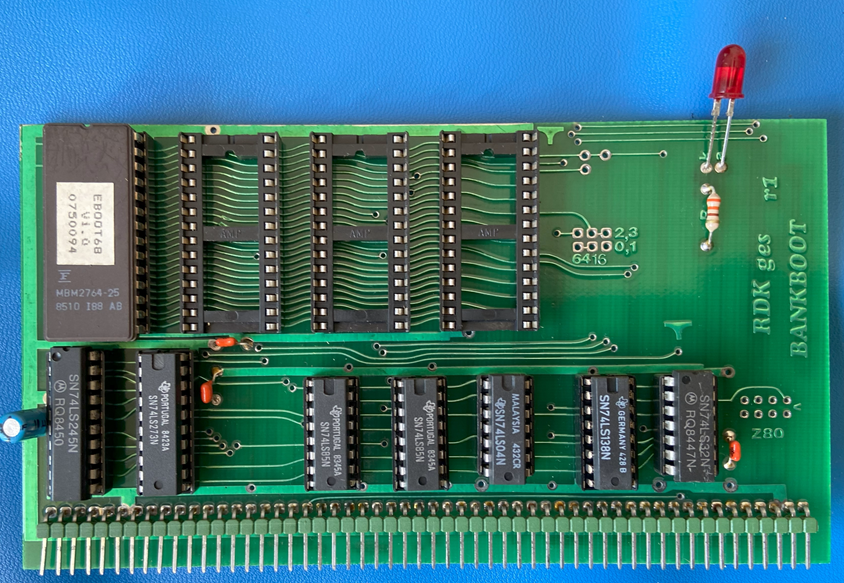

# BankBoot-Card

## Features
The BankBoot card is used to hide RAM memory at addresses 0x00000 to 0x07FFF and have ROM code mapped to these addresses during boot time. The original could also be programmed to switch between RAM banks on 8-bit systems, but this is currently not supported, see Limitations.

## Configuration
The following section of the configuration file is used to configure the ROM image to use for the BankBoot ROM:

`BankBootRom: ./resources/roms/BKBOOT08.ROM`

## Limitations
1. Currently only the banking at boot time is supported as needed by the 68000 implementations of the NDR-Klein Computer. Bank selection, as used in Z80 systems is not implemented.
2. No additional ROMs or RAMs on board of the BankBoot card are supported

## Future Enhancements
1. Add support for memory bank selection to also support Z80 implementations
2. Add LED support for the GUI

## References

1. Description on NDR-NKC.de (https://www.ndr-nkc.de/compo/memory/bankboot.htm)
