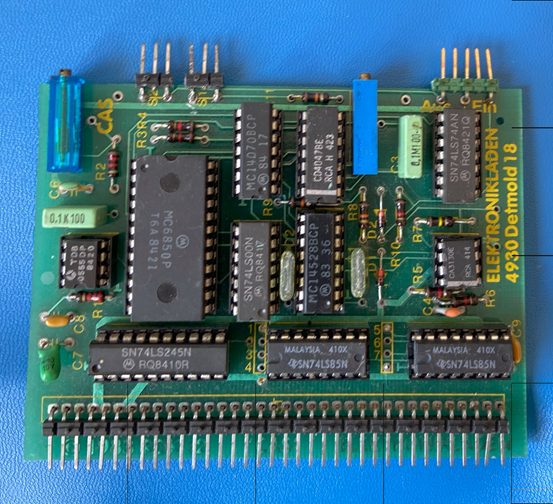

# CAS-Interface

## Features
The CAS Interface was used to save and load programs from standard cassette drives. It is simulated using a binary file. The format of the bytes is defined by the NDR-Klein-Computer.
You can convert text files to cas files using the python script "caswriter68k.py" you may find in my dedicated GitHub repositroy

See: [nkc-cas-writer](https://github.com/merckm/nkc-cas-writer)

It is however easier to use the clipboard support for the Key-Interface to paste text into the editor of the NDR-Klein-Computer "Grundprogramm".

I have also a repository with a utility to convert between CAS files
and WAV files which can be used to record real cassettes. It can also
convert from a cassette recording in WAV format to a CAS file.

See: [nkc-wav-utilities](https://github.com/merckm/nkc-wav-utilities)

The following features are currently implemented:

1. Hitting the F3 key inside of the main (GDP64) window will rewind the cassette to its begining
2. The cassette can be changed using the GUI button with a foto of a cassette tape. You can select any file with the ending ".cas". Currently you can not create a new file from the GUI, but you can easily create a empty file in your OS with the filetyoe of ".cas" and use it as a blank cassette. 

## Configuration

The following section of the configuration file is used to configure the cassette file:

    - CasFile: ./cassette.cas

## Limitations

1. CAS-Files will be overwritten without any warning. 
2. The position of the cassette can't currently be manipulated other then rewinding the cassette with the F3 key.
3. Trying to read texts/data, when non is available (e.g., at end of tape) will result in the NDR-Klein Computer hanging and needing to be manually reset (like the original)
4. Length of CAS files is only limited by free space on the disk where the CAS-file resides.

## Future Enhancements

1. Add support in the GUI to allow free positioning on the tape (A list of recordings is already compiled during opening of a tape which contains the starting positions of the recordings).
2. (MAYBE) Add timing support to allow simulation of real cassette speed (e.g 1200 BAUD transfer)

## References

1. Description on NDR-NKC.de (https://www.ndr-nkc.de/compo/storage/cas.htm)
2. Building instructions (https://hschuetz.selfhost.eu/ndr/doku/hardware/sonst/CAS.pdf)
