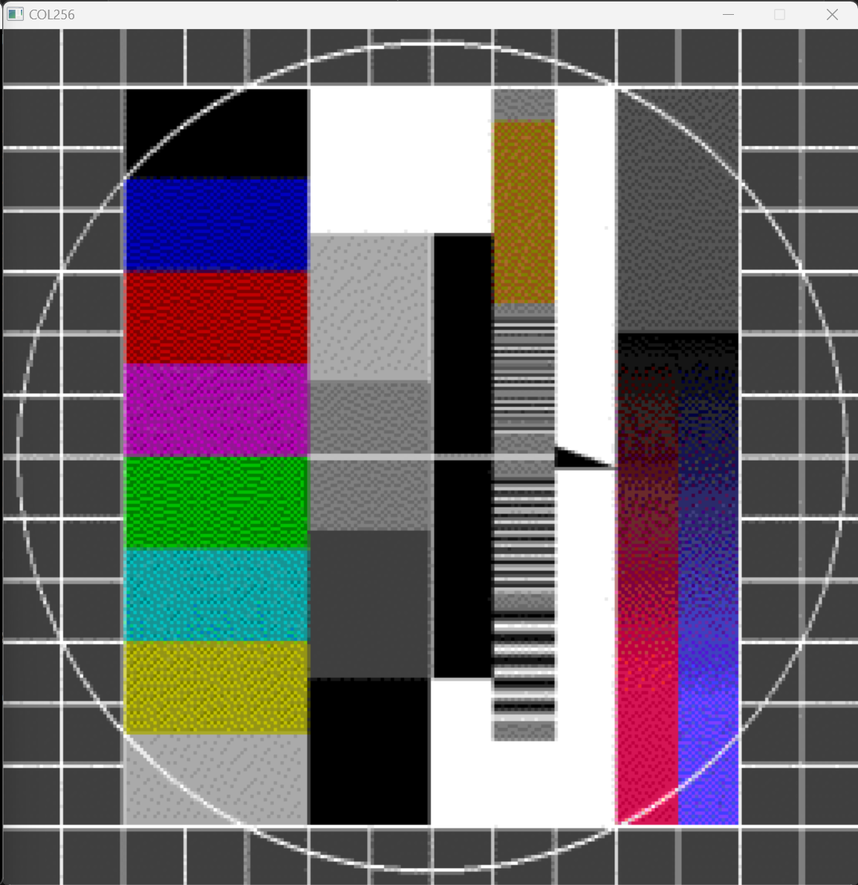

# COL256-Card

The COL256 set of cards (COL256A, COL256B and COL256C) was used as an add-on graphics system offering color output.
 
## Features

1. COL256 is supported as a second display and a second window is opened.
2. Graphics memory can be read back.
3. The simulation will recognize both io port ranges 0xFFFFFFCC-0xFFFFFFCE (used originally) and 0xFFFFFFAC-0xFFFFFFAE (used by JADOS) 

## Configuration

The following section of the configuration file is used to configure the COL256 scaling and RAM window location:

    - Col256XMag: 2             # Magnification factor for the Col256 display in X direction
    - Col256YMag: 2             # Magnification factor for the Col256 display in Y direction
    - Col256RAM: 0x000DC000     # Start address of the Col256 RAM window

## Limitations

1. Colors may not be correct. Base colors should be identical but shades may still not be correct. I have no original COL256 card, so can't compare. I used the test image from the [new release project](https://hschuetz.selfhost.eu/ndr/hardware/neu/grafik/col256/index.html) and it looks quite good to me. The test image, has however some limitations in its digitazation, not really using the 256 possible colors.

2. Only 256*256 graphics mode with fixed 68K graphics RAM is curently supported and the graphics RAM window is hard coded. 

## Future Enhancements

1. More configuration options.
2. (Maybe) support for other graphics modes
2. (Maybe) support for CLUT.

## References

1. Description on NDR-NKC.de (https://www.ndr-nkc.de/compo/graf/col256.htm)
2. Modern redesigned version of the COL256 card (https://hschuetz.selfhost.eu/ndr/hardware/neu/grafik/col256/index.html)