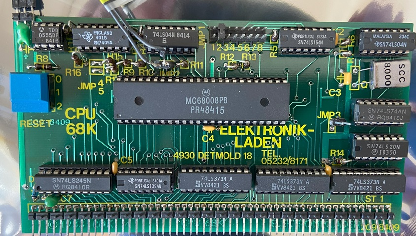

# CPU-Board

The Motorola 68008 CPU board.

## Features

1. CPU speed can be simulated including wait states. The simulation tries to smulate a 8MHz CPU. The number of wait states can be configured in the configuration file. The simulation will run at 600-1000 MHz on a very modern CPU. If the simulation is set to run at the original 8 MHz CPU speed, the speed will only be quite accurate on modern high speed CPUs. On lower performance CPUs (like on Raspberry PI 4 boards), the simulation is turbo mode will bre around (40-60 MHz), however the 8 MHz simulation will run slower due to graphic IO. 
2. Interrupts can be ienabled. The only interrupt sourceis the V-Sync signal which was connected to the /INT line on the bus and would generate a level5. All interrupts are auto-vectored like in the original.
3. Pins /IPL0/2 and /IPL1 (bus lines /INT and /NMI) can be combined to generate a level7 (NMI) interrupt on the 68008 CPU on the V-Sync signal edge.  

## Configuration

The following section of the configuration file is used to configure the CPU speed amd wait states:

    - CPUSpeed: 8               # CPU speed in MHz
    - NumWaitStates: 3          # Number of wait states for memory access

## Limitations

1. As discribed earlier, real CPU speed simulation has limitations.

## Future Enhancements

1. None currently planed

## References

1. Description on NDR-NKC.de (https://www.ndr-nkc.de/compo/68000/cpu68k.htm)
