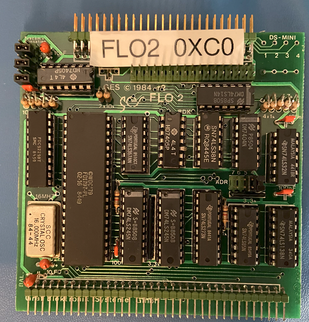

# FLO2 Floppy Disk Controller-Card

## Features

The FLO2 floppy disk controller on the NDR-Klein Computer was used to connect floppy disks and boot operatiung systems like CP/M 68K, JADOS or JogiDOS. The controller allowed to connect 8' (also called Maxi) drives and 5,25', 3.5' and 3' (called Mini) floppy disk drives. The default drive of the NKC was the TEAC FD-55 F drive, which was a dual sided DS double density DD dirve which was formated for 800 KByte capacity. However lots of differnet drives and formats could be used.

1. Floppy disks are simulated by floopy image files with the data being sequentially arranged for weacvh ector and track. You can creae these image files from Teledisk TD0 files using the HxC Floppy Emulaor Software (https://hxc2001.com/download/floppy_drive_emulator/). Please refer to the [Manual](https://hxc2001.com/download/floppy_drive_emulator/HxC_Floppy_Emulator_Software_User_Manual_ENG.pdf) for detailed instructions.
2. A utility to create empty formated disks (compatible with CP/M 68k and JADOS but not JogiDOS) is provided inside the ./resources/disks disk folder. This utility (makedisk.py) takes no arguments and imply creates a 800kByte file filled with 0xE5 bytes. To use this disk for JogiDOS you need to reformated with the JogiDOS format utility to create the correct directory structures.
3. A diskdefs file is provided in the ./resources/disks directory which can be used for CP/M68k disk to inspect and transfer files with the [cpmtools](https://github.com/lipro-cpm4l/cpmtools) utility. Under findows you must install this utiliy with WSL2. Some sample commands are:

 

    cpmls -f nkc-68k NKC1CPM68K.img
    cpmcp -f nkc-68k NKC1CPM68K.img <LOCALFILE> <USER>:<CPMFILE>
    cpmcp -f nkc-68k NKC1CPM68K.img <LOCALFILE> <USER>:
    cpmcp -f nkc-68k NKC1CPM68K.img <USER>:<CPMFILE> <LOCALFILE>
    cpmrm -f nkc-68k NKC1CPM68K.img <PATTERN>

4. The 5.25', 3.5' and 3' floppy disks with the NDR Format (80 Tracks, 5 Sectors, 1024 Bytes) are supported.
5. Formatting of floppy drives via software seems to be working. Please be carefull when formating disk with a formating software. Using the wrong disk parameters will crash or hang the simulation.

## Configuration

The following sections of the configuration file are used to configure the floppy disk image files:

    - DriveA: ./resources/disks/NKC1CPM68K.img
    - DriveB: ./resources/disks/NKC2CPM68K.img
    - DriveC:
    - DriveD:

## Limitations

1. Other floppy disk formats other than the NDR format are currently not supported (specifically only disks A and B are currently supported).
2. Timing is much too fast and immediate. This is quite convinient, as the Floppy drives behaive basically as a very fast RAM disks. For reproducing the real feel of the 80's some simulation of the correct timing would be needed.
3. Write protection is not simmulated and the floppy disk image files may be overwritten or corrupted during operations. (**Please make frequent backups**).

## Future Enhancements

1. Support for 8' Floppy drives (Drives C, D, E and F)
2. Add timing support to allow simulation of real floppy operations.
3. (Maybe) add visual feedback on the GUI using the Floppy LEDs during access.
4. (Maybe) add sound of floppy activity.

## References

1. Description on NDR-NKC.de (https://www.ndr-nkc.de/compo/storage/flo2.htm)
