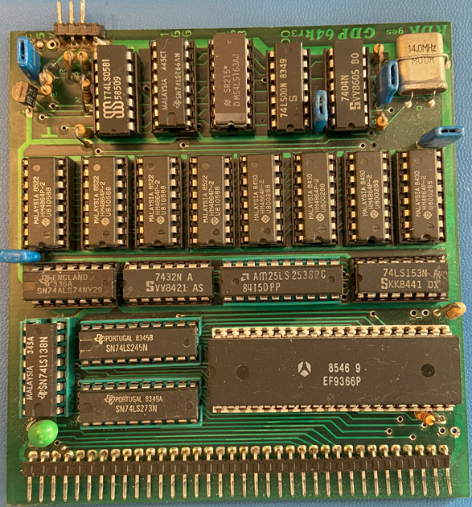

# GDP64K Graphics Card

## Features

1. The GDP window of 512*256 pixel can be scalled to better fit modern high resolution displays and make the viewport more quadratic resembling an original monitor.
2. While the GDP Window is active, the following 4 function keys are acitve:

- F1: Toggle to full screen more (Only the GDP64 window will be displayed in full screen mode)
- F2: Rewind the cassette tape
- F3: Reset the computer (Same as pressing the Reset-button on the front panel)
- F4: Toggle trace mode (Instruction trace is displayed on the console, only usefull for debuging)

## Configuration

The following section of the configuration file is used to configure the printer file:

    - GDP64XMag: 2              # Magnification factor for the GDP64 display in X direction      
    - GDP64YMag: 3              # Magnification factor for the GDP64 display in Y direction

## Limitations

1. Drawing speed is not simulated and will depend on the host CPU speed.
2. Only software rendering is used to avoid peoblems when running in virtual machines like Virtual Box.

## Future Enhancements

1. (Maybe) Addition of a GDP64HS mode.

## References

1. Description on NDR-NKC.de (https://www.ndr-nkc.de/compo/graf/gdp64k.htm)
