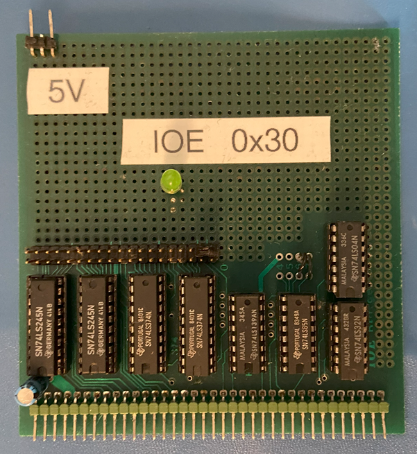
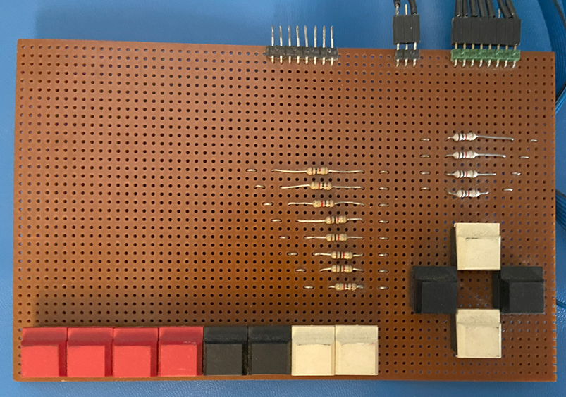
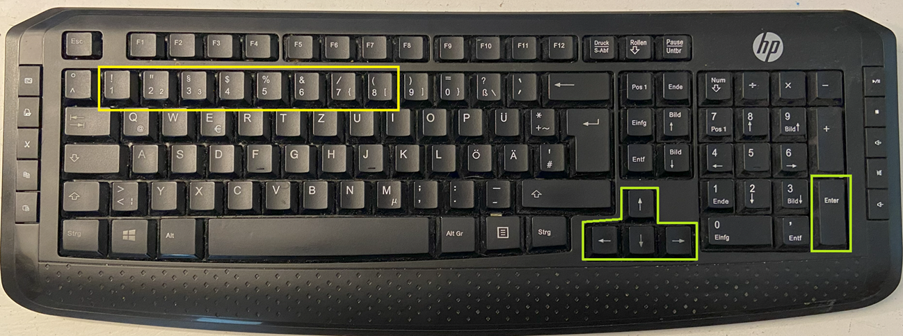

# IOE Parallel Input and Output

## Features

The IOE card offered two freely programmable 8 bit parallel input and two 8-bit output ports.  

Several experiments were described in the book "Die Prozessoren 68000 und 68008", like connecting stepper motors and switches to run the motor (p. 94-116). This was even extended to build a fully functional plotter (p. 116-130). 
In the following sections of the book, a lunar landing game was implemented. The game could be controled using 4 keys (I arranged them in a cross pattern) (see also p.136), or using a joystick (p.145). My example board used in the 89's is shown below.

1. Outputs are available in the simulation as LED images on the frontpanel screen.
2. Joysticks may be configured as inputs for each port. The following is the assignment of the different movements to the IOE bits:
    - Right    : bit 1, mask 0x01
    - Left     : bit 2, mask 0x02
    - Up       : bit 3, mask 0x04
    - Down     : bit 4, mask 0x08
    - Button 1 : bit 5, mask 0x10
    - Button 2 : bit 6, mask 0x20
    - Button 3 : bit 7, mask 0x40
    - Button 4 : bit 8, mask 0x80
3. The buttons are simulated using the keyborad Buttons 1-8 in conjunction with the ALT-key, willset the corresponding bit in IOE while pressed together. This is true for aboth input ports, so if you read in quick succession ports $FFFFFF30 and $FFFFFF31 while holding one of the numerical key together with the ALT-key, you wil lsee the same data. You can also press several of the keys 1-8 together with the ALT-key to genenrate more complex bit patterns. If your keyboard (typically true for 105-key keybords), has a separate cursor block (see imae below), they can also be used to simulte IOE input keys. The ENTER-key on the numerical keypad, will generate a fire button input on the IOE as described in the table below:
    - Cursor Right    : bit 1, mask 0x01
    - Cursor Left     : bit 2, mask 0x02
    - Cursor Up       : bit 3, mask 0x04
    - Cursor Down     : bit 4, mask 0x08
    - Keypad ENTER    : bit 5, mask 0x10

## Configuration

The following section of the configuration file is used to configure any joysticks for the IOE ports:

    - JoystickA: SPEEDLINK COMPETITION PRO
    - JoystickB:

This should not be edited manually but better configured using the GUI by clicking on the jostick symbols.

## Limitations

1. Only one IOE Card at address $FFFFFF30 is simulated. In the original NKC several IOE interfaces could be used and different adresses could be configured.
2. The LED outputs are only updated every 10ms (If run on a fast enough computer). Higher update frequencies are not simulated.
3. No hot-plug capabilities. The list of available joysticks is only retrieved at program start. Joysticks plugged in after the start of the simulation will not be detected intil the application is restarted.
4. The thershold for analog joysticks is hard coded and can't be configred.

## Future Enhancements

1. Hot plug capability.
2. Plugable adapters for IO (for example remote GPIO on a Raspberry Pi) to allow real hardware connections.

## References

1. Description on NDR-NKC.de (https://www.ndr-nkc.de/compo/io/ioe.htm)
2. Description of key (p. 99-101 and p.136) and joystick (p.145-146) connection in the book "Die Prozessoren 68000 und 68008" (https://www.ndr-nkc.de/download/books/buch_68000_und_68008.pdf)