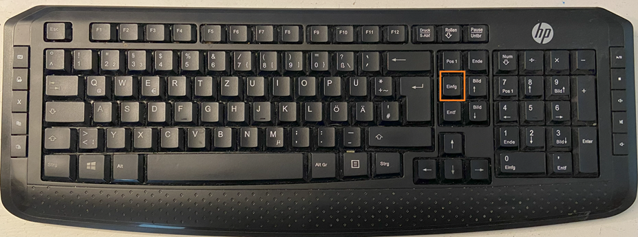

# KEY-Interface

## Features
The KEY Interface is a simple parallel keyboard interface for the NDR-Klein-Computer. In addition to the keyboard there are 8 DIL switches on the card which can be read and are used in newer versions of the "Grundprogramm" BIOS.

The following features are currently implemented:

1. Normal key operations with translation of individual scan codes to the ASCII characters.
2. Support of pasting the clipboard into the GDP64 input window. We can't use CTRL-V to paste, as the CTRL-<Key> sequences are used in the NDR-Klein computer to enter ASCII codes 0-31. If you have a 105 key-keyboard, you can use the 'Insert' key above the cursor block to paste the clipboard content.
.
For Laptops and other keyboards, without the dedicated 'Insert' key, you can use the push-botton 'Paste' on the front panel window.
23. Support to set the DIP switches in the configuration file. 

## Configuration

The following section of the configuration file is used to configure the KEY DIL switches:

    - KeyDILSwitches: 0x07      # DIL switches for the Key card used for boot configuration

The meaning of the individual bits are:

|                  | Grundprogramm 6.x        | Grundprogramm 7.x        |
| ---------------- | ------------------------ | ------------------------ |
| Bit 0 (0x01)     | Menu style  0=old/1=new  | reserved                 |
| Bit 1 (0x02)     | Boot menu   0=no /1=yes  | autoboot    0=no /1=yes  |
| Bit 2 (0x04)     | RTC Clock   0=no /1=yes  | RTC Clock   0=no /1=yes  |
| Bit 3 (0x08)     | GDP version 0=64K/1=64HS | GDP version 0=64K/1=64HS |
| Bit 4 (0x10)     | Harddisk    0=no /1=yes  | Harddisk    0=no /1=yes  |
| Bit 5 (0x20)     | reserved                 | IDE-disk    0=no /1=yes  |
| Bit 6 (0x40)     | reserved                 | GDP-FPGA    0=no /1=yes  |
| Bit 7 (0x80)     | reserved                 | reserved                 |

## Limitations

1. Non

## Future Enhancements

1. Non currently planed

## References

1. Description on NDR-NKC.de (https://www.ndr-nkc.de/compo/io/key.htm)
