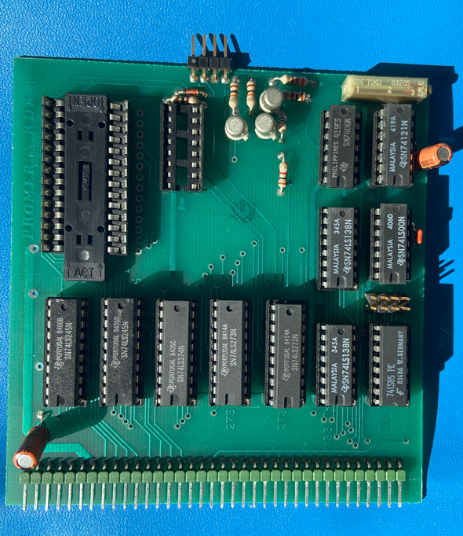

# PROMER EPROM Programmer



## Features

The PROMER was an IO card used to program 2716, 2732 or 2764 EPROMs to use on the different ROM slots of the system (Bankboot-Card or ROA64-Card).

1. Simulation of EPROM Programming is based on a binary ROM file. **ATTENTION**: The simulation simulates real EPROM writing, which means onls 0-bits can be programmed. You can't reset bit-0 to a bit-1 with the programmer. This means, you can't overwrite a once programmed EPROM without fully earasing it fist. With a real EPROM, you would erase the data with a UV-Lamp or exposing the quartz window for a longer time to direct sunlight. In the simulation you need to create a new empty EPROM file with the provided Python tool, see below. 
2. Support for 2716, 2732 and 2764 EPROM types. The simulation however will not need to switch the programming voltage (26V/21V) or plug in the patching IC socket to adjust for the different pinouts of the different chips, like you had to do in the original version.
3. Tool to easily create "empty" (filled with 0xFF) files. The tool is located in the resources/roms folder and the usage is as follows:

```python makeprom.py <EPRON-Type>```

with EPROM-Type being:

1. 1 = 2716
2. 2 = 2732
3. 3 = 2764

If you do not specify the EPROM type a 2764 file will be generated by default.


## Configuration

The following sections of the configuration file are used to configure the floppy disk image files:

    - PromFile: ./resources/roms/prom.bin

You can also change the PROM file at any time by clicking on the EPROM ZIF-Socker image.

## Limitations

1. Write and read speeds are not simulated but programming routines typically have wait loops during programming.
2. The socket adapter DIL, programming voltage selection and the programming LED are currently not simulated.

## Future Enhancements

1. (Maybe) add visual feedback on the GUI using the programming LED.

## References

1. Description on NDR-NKC.de (https://www.ndr-nkc.de/compo/io/promer.htm)
