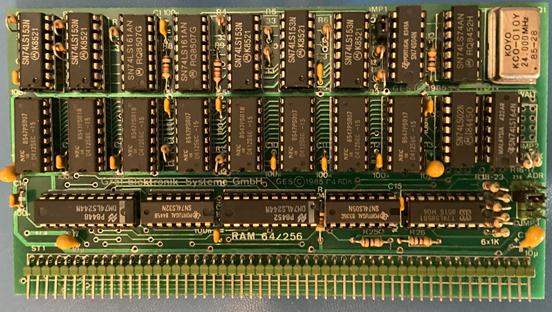
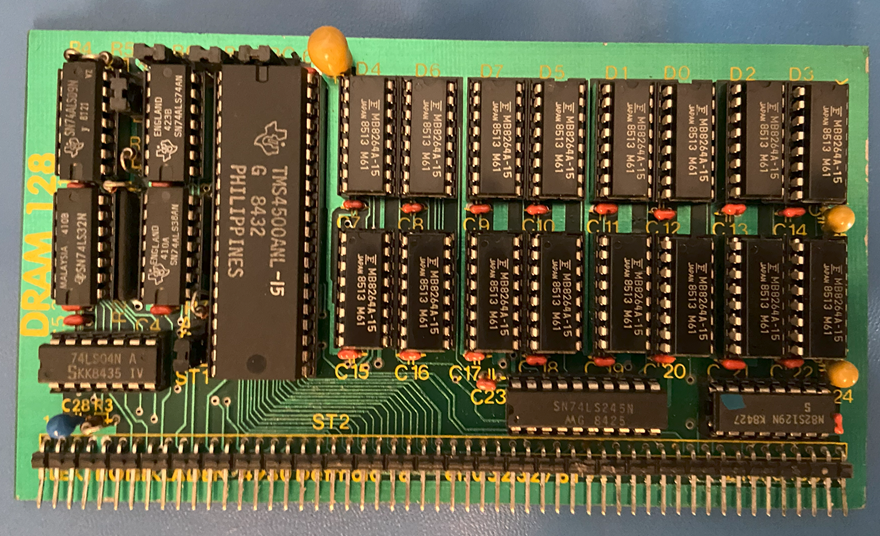

# Dynamic RAM-Borads

The NDR-Keli-Computer supported to different dynamic RAM cards.
1. The RAM256 board

2. The DDRAM128 board supporting 128kByte of RAM

## Features

The simulation is hardcoded to use a 512 kByte RAM block at adresses 0x00000000 to 0x007FFFFF.

## Configuration

No configuration for RAM is currently implemented.

## Limitations

1. Currently no configuration of RAM is available and the RAM is hardcoded in the simulation to consist of 512 kBytes (2 RAM256 boards or 4 DRAM128 boards or one RAM256 board and 2 DRAM128 boards) in the address rang 0x00000000 to 0x007FFFFF. Aditionally 32 kByte of static RAM is automatically configured for the memory used by the "Grundprogramm" BIOS.

## Future Enhancements

## Limitations

1. (MAYBE) Add support for memory configuration.

## References

1. Description of RAM256 on NDR-NKC.de (https://www.ndr-nkc.de/compo/memory/ram64256.htm)
2. Description of DRAM128 on NDR-NKC.de (https://www.ndr-nkc.de/compo/memory/dram128.htm)
