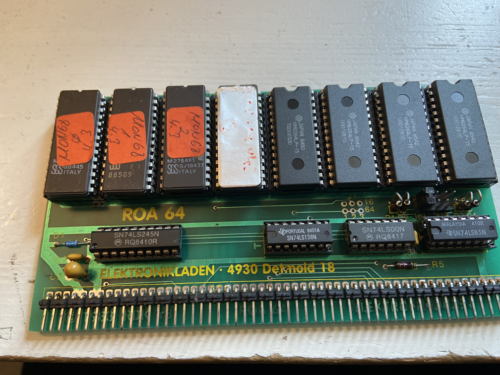

# Memory board for 8k ROM or RAM modules

## Features

The ROA card was used to hold up to 8 ROMs (2764) and staic RAMs (6264) on each card. Cards could be configured for any 64k memory address range to the last card on addresses $0E0000 - $0EFFFF. As peripherial devices were memory mapped with incomplete address decoding, the whole address range $0F0000-$0FFFFFF was reserve for IO devices.
 
The siumlation supports 5 ROA cards in the following address ranges:

1. $0A00000-$0AFFFF
2. $0B00000-$0BFFFF
3. $0C00000-$0CFFFF
4. $0D00000-$0DFFFF
5. $0E00000-$0EFFFF

Te following features are implemented:
1. ROMs can be configured in each slot
2. Size of ROMs needs to be specified for each slot. A single ROM would be 8192 bytes in size but you can also use bigger ROM binary files (like files concatenating all ROMs of a program, like PASCAL or GOSI). Be aware to not configure any other ROM in the space used by these larger ROM images. 
3. 32K of static RAM for the "GRUNDPROGRAMM" BIOS is automatically added depending on ROM konfiguration at address 0x0E0000. If a ROM is present at that location, it is assumed to the the Verison 4.3 Grundprogramm. Then the 32K RAM for "Grundprogramm" variables is configured for the address range $0E8000 - $0EFFFF. If no ROM is present at this addres, then RAM is configured at the address range $0E0000 - $0EFFFF. This allows for the newer "Grundprogramm" version 6.x or 7.x to be configured at ROM address 0x0D0000 and have the RAM on the next bank.

### Considerations on the COL256 memory window

The address range of the [COL256](./col256.md) 16k RAM window can be configured as part of the COL256 configuration. It typically should be located at 0x0DC000 - 0x0DFFFF address range for systems using the version 4.3 of the "Grundprogramm" and the range 0x0EC000 - 0x0EFFFF when using higher versions. In any case, please make sure not to configure any ROMs in the address range used by the COL256 window.

### Remarks on PASCAL/S RAM

[ROA-Pascal/S](./ROA64.png)

The documentation of PASCAL/S states that you will need an ectra 32K of static RAM immediatly following the 32k ROMs of PASCAL/S. This is not totally correct. This configuratin was only necessary for basic systems without [bankboot](./bankboot.md) with the PASCAL ROA covering the address space 0x010000 - 0x01FFFF. The memory needed for PASCAL/S to hold the PCODEs is fixed at address range $0180000 - $01FFFF. As we have a fixed [RAM](./ram.md) block in the address range 0x000000 - 0x07FFFF, no special SRAMs is needed for PACAL/S. 

## Configuration

The following entries are available to configure ROMs. Each socket can be configured individually. You need to speciffy the path to the ROM image and the size of the ROM (typically 8192). You can speciffy larger ROM images (of multiples of 8192) burt need to take care not to specify another ROM in the address range of the larger ROM.

    - RomPath_A0000:
    - RomSize_A0000: 32768
    - RomPath_A2000:
    - RomSize_A2000: 0
    - RomPath_A4000:
    - RomSize_A4000: 0
    - RomPath_A6000:
    - RomSize_A6000: 0
    - RomPath_A8000:  ./resources/roms/68008_UFORM68K_LIB.BIN
    - RomSize_A8000: 8192
    - RomPath_AA000: ./resources/roms/68008_DEMO11_LIB.BIN
    - RomSize_AA000: 8192
    - RomPath_AC000: 
    - RomSize_AC000: 0
    - RomPath_AE000: 
    - RomSize_AE000: 0
    - RomPath_B0000: 
    - RomSize_B0000: 0
    - RomPath_B2000:
    - RomSize_B2000: 0
    - RomPath_B4000:
    - RomSize_B4000: 0
    - RomPath_B6000:
    - RomSize_B6000: 0
    - RomPath_B8000: 
    - RomSize_B8000: 0
    - RomPath_BA000: 
    - RomSize_BA000: 0
    - RomPath_BC000: 
    - RomSize_BC000: 0
    - RomPath_BE000: 
    - RomSize_BE000: 0
    - RomPath_C0000: ./resources/roms/68008_GOSI.BIN
    - RomSize_C0000: 24576
    - RomPath_C2000:
    - RomSize_C2000: 0
    - RomPath_C4000:
    - RomSize_C4000: 0
    - RomPath_C6000: 
    - RomSize_C6000: 0
    - RomPath_C8000: 
    - RomSize_C8000: 0
    - RomPath_CA000: 
    - RomSize_CA000: 0
    - RomPath_CC000: 
    - RomSize_CC000: 0
    - RomPath_CE000: 
    - RomSize_CE000: 0
    - RomPath_D0000: ./resources/roms/68008_622.BIN
    - RomSize_D0000: 57344
    - RomPath_D2000: 
    - RomSize_D2000: 0
    - RomPath_D4000: 
    - RomSize_D4000: 0
    - RomPath_D6000: 
    - RomSize_D6000: 0
    - RomPath_D8000: 
    - RomSize_D8000: 0
    - RomPath_DA000: 
    - RomSize_DA000: 0
    - RomPath_DC000: 
    - RomSize_DC000: 0
    - RomPath_DE000: 
    - RomSize_DE000: 0
    - RomPath_E0000: 
    - RomSize_E0000: 0
    - RomPath_E2000:
    - RomSize_E2000: 0
    - RomPath_E4000:
    - RomSize_E4000: 0
    - RomPath_E6000:
    - RomSize_E6000: 0

## Limitations

1. Currently no configuration of static RAM is available and the RAM is hardcoded in the simulation to consist of 512 kBytes dynamic RAMS (2 RAM256 boards or 4 DRAM128 boards or one RAM256 board and 2 DRAM128 boards) in the address rang 0x00000000 to 0x007FFFFF. Aditionally 32 kByte of static RAM is automatically configured for the memory used by the "Grundprogramm" BIOS.

## Future Enhancements

1. Non planned.

## References

1. Description on NDR-NKC.de (https://www.ndr-nkc.de/compo/memory/roa64.htm)
